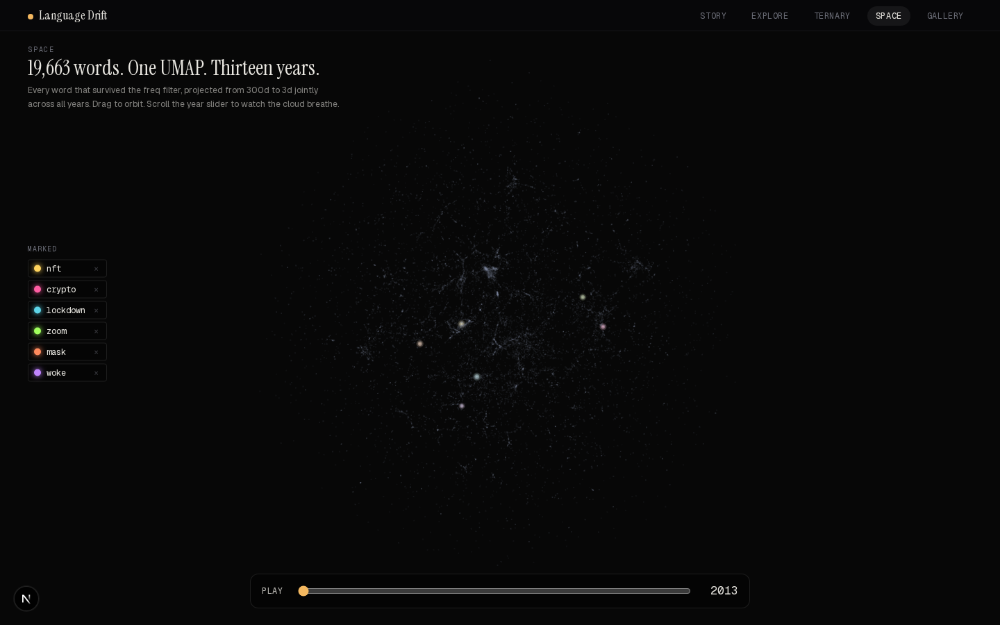

# Language Drift

**[→ Live demo: language-drift.vercel.app](https://language-drift.vercel.app)**

Thirteen separate Word2Vec models — one per year, 2013 through 2025, trained on a billion tokens of Common Crawl each — aligned into a shared coordinate system so the same word has 13 comparable positions. The result is a quantitative, interactive view of how English usage actually changed over the last decade.

`PyTorch · Word2Vec (SGNS) · Orthogonal Procrustes · UMAP · Next.js · Three.js · D3 · Framer Motion`


## What you can do with it

| | |
|---|---|
|  | **`/explore` — constellation view.** Pick a word; scroll to scrub through the years. Watch a word's nearest neighbors fly in and out as its meaning shifts. Click any neighbor to dive into it. |
|  | **`/ternary` — three-pole projection.** Pick three anchor words (e.g. `halloween`, `virus`, `cloth`) and a target (`mask`). Each year's barycentric position is the target's cosine similarity to each anchor, projected into the triangle. The COVID arc is dead-obvious. |
|  | **`/space` — 3D embedding cloud.** All 19,663 vocabulary words projected to 3D via UMAP, jointly across all years. Hit play and the cloud breathes between 2013 and 2025 as each word interpolates along its 13-year path. Mark words to follow them through the cloud. |

## Findings

The pipeline gives a noise floor (stable words drift ~0.10 per year-pair under Procrustes alignment) and a signal ceiling (real neologisms shift 5–10× harder). A few examples, total cosine drift summed across 12 year-pairs:

| Word | Total drift | What changed |
|---|---|---|
| `nft` | **11.19** | Pre-2020: barely exists in the corpus. 2021+: cluster centered on art, blockchain, scam. |
| `crypto` | **9.33** | "Cryptography → currency" in five years. |
| `lockdown` | **8.59** | From "prison protocol" to "everyday word." |
| `mask` | **4.33** | A disguise (halloween, costume) → a cloth covering (surgical, wearing, virus). |
| `zoom` | **4.71** | A verb meaning "go fast" → a noun meaning "meeting." |
| `woke` | **3.78** | Past tense of wake → cultural flag. |
| `music` | 1.10 | Anchor word — sits right at the noise floor. |
| `father` | 1.15 | Anchor word — barely moves. |

The site lets you drive these comparisons yourself across all 19,663 eligible words.

## How the pipeline works

```
FineWeb (Common Crawl, 2013–2025)
   │
   ▼
1. Stream + tokenize ~1B tokens/year, language-filtered (score ≥ 0.65)
   │
   ▼
2. Build a single shared vocabulary across all 13 years
   (~120K tokens that appear in ≥12 years with freq ≥50)
   │
   ▼
3. Train one Word2Vec SGNS per year on GPU
   (300d, window 5, 5 negatives, in-RAM map-style dataset)
   │
   ▼
4. Procrustes-align every year onto 2013's coordinate system
   (orthogonal rotation on L2-normalized embeddings)
   │
   ▼
5. Compute drift parquet files (per-word cosine distance per year)
   │
   ▼
6. Precompute the static JSON / binary shards the web app reads
```

Step 4 is what most "train Word2Vec on a corpus" tutorials skip — and it's the only reason any of this is comparable. Each year's independently-trained model lives in its own arbitrarily-rotated coordinate system, so raw cosines across years are noise. Procrustes finds the orthogonal rotation that lines them up, anchored on a stable reference year (2013). Without it, the drift signal vanishes into the alignment noise.

The web app is fully static: every page prerenders, and per-word data ships as JSON + float32 binary shards under `/data/` so client-side cosine math (the `/ternary` view) runs without a server.

## Tech stack

| Layer | Tools |
|---|---|
| Data | FineWeb / Common Crawl, HuggingFace `datasets`, Python 3.13, `uv` |
| Training | PyTorch (Skip-gram + Negative Sampling), CUDA, dense Adam |
| Analysis | NumPy, SciPy, scikit-learn, UMAP, pandas (parquet) |
| Frontend | Next.js 16 (App Router), TypeScript, Tailwind v4, Framer Motion, D3, Three.js + react-three-fiber + drei |
| Deploy | Vercel (Git integration, auto-deploy on `main`) |

## Running it yourself

Most readers won't need to — the deployed site is the demo. But if you want to retrain on a different corpus, or iterate on the architecture, the pipeline is fully reproducible from scratch.

<details>
<summary><b>Full pipeline setup</b> (Python 3.13, GPU recommended, ~100 GB disk, 128 GB RAM)</summary>

### Setup

```bash
git clone https://github.com/scheuclu/language_drift.git
cd language_drift
uv sync
```

### Stage 1 — Data pipeline

Stream and tokenize (resumable):

```bash
uv run python scripts/run_data_pipeline.py --all              # all years
uv run python scripts/run_data_pipeline.py --year 2013        # one year
```

Outputs per year: `data/tokens/{year}_tokenized.txt.gz`, `data/tokens/{year}_freqs.json`.

Build shared vocab (requires all years):

```bash
uv run python scripts/run_data_pipeline.py --build-vocab
```

Encode tokenized text to int32 arrays:

```bash
uv run python scripts/run_data_pipeline.py --encode --all
```

### Stage 2 — Train embeddings (GPU)

```bash
uv run python scripts/run_training.py --all --device cuda
```

Outputs: `models/embeddings/{year}.npy`. ~1–3 hours per year on a single GPU.

Hyperparameters live in `config.py`:

| | |
|---|---|
| Embedding dim | 300 |
| Window | 5 |
| Negative samples | 5 |
| Batch size | 32,768 |
| Learning rate | 0.0075 (linear decay) |
| Epochs | 3 |

### Stage 3 — Alignment + drift

```bash
uv run python scripts/run_analysis.py --all
```

Outputs `models/aligned/{year}.npy` and `models/drift/*.parquet`.

### Stage 4 — Web data shards

These three scripts take the aligned embeddings and emit everything the web app needs under `web/public/data/`:

```bash
uv run python scripts/precompute_web_data.py   # manifest + per-word JSONs
uv run python scripts/precompute_vectors.py    # per-word aligned vectors (.bin)
uv run python scripts/precompute_tsne.py       # joint 3D UMAP for /space
```

After retraining, re-run these three and commit the new snapshot — Vercel auto-deploys.

### Project structure

```
config.py                          # hyperparameters + paths (single source of truth)
pipeline/
  snapshot_registry.py             # year → CC-MAIN snapshot mapping
  tokenizer.py                     # text normalization
  vocab.py                         # shared vocabulary construction
  data_pipeline.py                 # streaming, tokenization, encoding
training/
  word2vec.py                      # PyTorch SGNS model
  dataset.py                       # map-style in-RAM dataset
  train.py                         # GPU training loop
analysis/
  alignment.py                     # orthogonal Procrustes
  drift.py                         # cosine drift metrics
scripts/
  run_data_pipeline.py             # Stage 1 CLI
  run_training.py                  # Stage 2 CLI
  run_analysis.py                  # Stage 3 CLI
  precompute_*.py                  # Stage 4 (web data)
web/                               # Next.js app — see web/README.md
```

</details>

## Data source

[HuggingFaceFW/fineweb](https://huggingface.co/datasets/HuggingFaceFW/fineweb) — 15 trillion tokens of cleaned English web text from Common Crawl, 2013–2025. Licensed ODC-BY.

## Author

Built by [Lukas Scheucher](https://github.com/scheuclu). MIT licensed.
